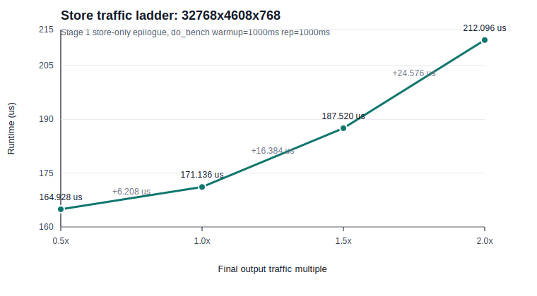

# SwiGLU Extra Store Results

This study keeps the MMComposer compute path fixed and changes only the
pipelined TMA-store epilogue output traffic.

Base config:

```text
BM=128 BN=256 BK=64 NS=5 GSM=1 NW=4
PERSISTENT=1 OVERLAP=1 SPLIT=0 L1NA=0 TMA_PIPE=1 SINGLE_TMEM=0 TWO_CTA=1
```

Variants:

- `base`: write only `C[M, N]`.
- `extra-half`: write `C[M, N]` plus `D[M, N/2]`.
- `extra-full`: write `C[M, N]` plus `D[M, N]`.

Timing:

```text
triton.testing.do_bench(warmup=1000ms, rep=1000ms)
cuBLAS = median of 10 measured samples after 1 throwaway sample
```

Artifact:
`study-swiglu-extra-store/_scratch/results_vary_n_1000_1000.json`

All C and D correctness checks passed.

## cuBLAS Reference

cuBLAS is plain `torch.mm(A, B)` for the same `M x N x K` shapes. Runtime is
derived from the recorded median cuBLAS TFLOPS:

```text
us = 2 * M * N * K / (TFLOPS * 1e6)
```

| Shape | cuBLAS TFLOPS | cuBLAS us |
| --- | ---: | ---: |
| `32768x4608x768` | 1371.0 | 169.168 |
| `32768x9216x768` | 1344.0 | 345.128 |
| `32768x12288x768` | 1255.2 | 492.720 |
| `32768x18432x768` | 1307.2 | 709.712 |
| `32768x24576x768` | 1304.3 | 948.384 |
| `32768x32768x768` | 1304.0 | 1264.752 |

## Stage 1

`stages=1` means one TMA-store SMEM buffer. The epilogue still uses TMA stores,
but it waits before reusing that single `STORE_N=64` buffer for the next chunk.

| Shape | Base us | Half us | Full us | Half slow | Full slow | Base TF/% | Half TF/% | Full TF/% |
| --- | ---: | ---: | ---: | ---: | ---: | ---: | ---: | ---: |
| `32768x4608x768` | 175.136 | 191.552 | 222.208 | 1.094x | 1.269x | 1324.3 / 96.6% | 1210.8 / 88.3% | 1043.7 / 76.1% |
| `32768x9216x768` | 353.152 | 407.552 | 471.040 | 1.154x | 1.334x | 1313.5 / 97.7% | 1138.2 / 84.7% | 984.7 / 73.3% |
| `32768x12288x768` | 476.320 | 552.064 | 636.096 | 1.159x | 1.335x | 1298.4 / 103.4% | 1120.3 / 89.3% | 972.3 / 77.5% |
| `32768x18432x768` | 754.624 | 853.024 | 963.488 | 1.130x | 1.277x | 1229.4 / 94.0% | 1087.6 / 83.2% | 962.9 / 73.7% |
| `32768x24576x768` | 1019.984 | 1157.120 | 1299.616 | 1.134x | 1.274x | 1212.7 / 93.0% | 1069.0 / 82.0% | 951.8 / 73.0% |
| `32768x32768x768` | 1400.896 | 1585.280 | 1767.424 | 1.132x | 1.262x | 1177.3 / 90.3% | 1040.4 / 79.8% | 933.1 / 71.6% |

Average slowdown over these shapes:

```text
extra-half: 1.134x
extra-full: 1.292x
```

## Stage 2

`stages=2` means two TMA-store SMEM buffers. This is the production default for
the pipelined TMA-store epilogue, but earlier low-K studies showed the one-store
output often prefers stage 1.

| Shape | Base us | Half us | Full us | Half slow | Full slow | Base TF/% | Half TF/% | Full TF/% |
| --- | ---: | ---: | ---: | ---: | ---: | ---: | ---: | ---: |
| `32768x4608x768` | 177.376 | 197.440 | 226.304 | 1.113x | 1.276x | 1307.6 / 95.4% | 1174.7 / 85.7% | 1024.9 / 74.8% |
| `32768x9216x768` | 365.632 | 420.896 | 476.064 | 1.151x | 1.302x | 1268.6 / 94.4% | 1102.1 / 82.0% | 974.4 / 72.5% |
| `32768x12288x768` | 492.608 | 568.288 | 638.080 | 1.154x | 1.295x | 1255.5 / 100.0% | 1088.3 / 86.7% | 969.3 / 77.2% |
| `32768x18432x768` | 773.216 | 875.584 | 973.856 | 1.132x | 1.259x | 1199.8 / 91.8% | 1059.5 / 81.1% | 952.6 / 72.9% |
| `32768x24576x768` | 1045.552 | 1187.744 | 1318.816 | 1.136x | 1.261x | 1183.1 / 90.7% | 1041.4 / 79.8% | 937.9 / 71.9% |
| `32768x32768x768` | 1443.936 | 1620.960 | 1802.272 | 1.123x | 1.248x | 1142.2 / 87.6% | 1017.5 / 78.0% | 915.1 / 70.2% |

Average slowdown over these shapes:

```text
extra-half: 1.135x
extra-full: 1.274x
```

## Stage 1 vs Stage 2

| Shape | Base S1/S2 us | Half S1/S2 us | Full S1/S2 us |
| --- | ---: | ---: | ---: |
| `32768x4608x768` | 175.1 / 177.4 | 191.6 / 197.4 | 222.2 / 226.3 |
| `32768x9216x768` | 353.2 / 365.6 | 407.6 / 420.9 | 471.0 / 476.1 |
| `32768x12288x768` | 476.3 / 492.6 | 552.1 / 568.3 | 636.1 / 638.1 |
| `32768x18432x768` | 754.6 / 773.2 | 853.0 / 875.6 | 963.5 / 973.9 |
| `32768x24576x768` | 1020.0 / 1045.6 | 1157.1 / 1187.7 | 1299.6 / 1318.8 |
| `32768x32768x768` | 1400.9 / 1443.9 | 1585.3 / 1621.0 | 1767.4 / 1802.3 |

Stage 1 is faster in every measured variant and shape here. Adding the second
output tensor does not make the two-buffer TMA-store pipeline win for this
BN256 low-K config.

## Interpretation

The runtime grows as extra output bytes grow:

- `0x` extra output: base.
- `0.5x` extra output: about `1.13x` runtime.
- `1.0x` extra output: about `1.27-1.29x` runtime.

The growth is substantial but sublinear relative to total output bytes. That
means the original kernel is not purely C-store-bandwidth bound, but the store
traffic is exposed enough that a SwiGLU-like extra output tensor materially
reduces effective matmul TFLOPS.

This also reinforces the earlier stage-count result: more TMA-store buffers are
not the helpful response for the BN256 low-K path. Even with extra output
traffic, stage 2 remains slower than stage 1.

## Fused SwiGLU Compute

The first fused variant, `swiglu-half`, adds the actual SwiGLU epilogue
computation and stores backward save-factors. For each `BN=256` wide output
tile:

```text
left = columns [0, 128)
gate = columns [128, 256)
C factors [0, 128)   = silu(gate)
C factors [128, 256) = left * silu_prime(gate)
D output [0, 128)    = left * silu(gate)
```

This matches the fused Triton `save_factors` semantics at the tile level. The
saved stage-1 source is:

```text
study-swiglu-extra-store/fused_matmul_swiglu.cu
```

Artifact:
`study-swiglu-extra-store/_scratch/results_swiglu_half_1000_1000.json`

All C factor and D output correctness checks passed.

| Shape | Store-half S1 us | SwiGLU S1 us | SwiGLU/Store S1 | Store-half S2 us | SwiGLU S2 us | SwiGLU/Store S2 | SwiGLU S1 TF/% | SwiGLU S2 TF/% |
| --- | ---: | ---: | ---: | ---: | ---: | ---: | ---: | ---: |
| `32768x4608x768` | 191.552 | 420.832 | 2.20x | 197.440 | 386.112 | 1.96x | 551.1 / 40.2% | 600.7 / 43.8% |
| `32768x9216x768` | 407.552 | 817.152 | 2.01x | 420.896 | 744.480 | 1.77x | 567.7 / 42.4% | 623.1 / 46.5% |
| `32768x12288x768` | 552.064 | 1072.128 | 1.94x | 568.288 | 996.480 | 1.75x | 576.9 / 45.9% | 620.7 / 49.4% |
| `32768x18432x768` | 853.024 | 1599.456 | 1.88x | 875.584 | 1500.256 | 1.71x | 580.0 / 44.1% | 618.4 / 47.0% |
| `32768x24576x768` | 1157.120 | 2123.872 | 1.84x | 1187.744 | 1998.880 | 1.68x | 582.4 / 44.7% | 618.8 / 47.4% |
| `32768x32768x768` | 1585.280 | 2907.168 | 1.83x | 1620.960 | 2744.464 | 1.69x | 567.3 / 43.4% | 600.9 / 46.0% |

Stage comparison for fused SwiGLU:

| Shape | S1 us | S2 us | S2 speedup |
| --- | ---: | ---: | ---: |
| `32768x4608x768` | 420.832 | 386.112 | 1.090x |
| `32768x9216x768` | 817.152 | 744.480 | 1.098x |
| `32768x12288x768` | 1072.128 | 996.480 | 1.076x |
| `32768x18432x768` | 1599.456 | 1500.256 | 1.066x |
| `32768x24576x768` | 2123.872 | 1998.880 | 1.063x |
| `32768x32768x768` | 2907.168 | 2744.464 | 1.059x |

This is the first variant where stage 2 is clearly better than stage 1. The
initial hypothesis was that stage 2 wins because the epilogue has enough
elementwise work to overlap with TMA-store completion. Later wait-placement
experiments show that explanation is incomplete: the more important difference
is SMEM buffer reuse between consecutive output stores. A fused SwiGLU paired
chunk emits multiple output stores back-to-back, so one store buffer forces the
next SMEM write to wait for the previous TMA store to drain. With two buffers,
the next output can be packed into the alternate SMEM buffer while the previous
store remains in flight.

So the stage-count conclusion is conditional:

- Store-only BN256 low-K path: stage 1 is best.
- Fused SwiGLU BN256 low-K path: stage 2 is best by about `6-10%`.

### NS=6 and Wait-Placement Check

After the pure matmul autotune found that `TMA_STORE_STAGES=1` frees enough
SMEM to use `NS=6`, we tested the same tradeoff for `swiglu-out-fast` at
`32768x4608x768`.

Artifacts:

```text
study-swiglu-extra-store/_scratch/results_swiglu_out_fast_ns6_s1_s2_1000_1000.json
study-swiglu-extra-store/_scratch/results_swiglu_out_fast_wait_placement_ns6_1000_1000.json
```

| Variant | NS | TMA stages | TFLOPS | Runtime |
| --- | ---: | ---: | ---: | ---: |
| baseline source order | 5 | 2 | 1186.6 | `195.456 us` |
| baseline source order | 6 | 1 | 1083.0 | `214.144 us` |
| baseline source order | 6 | 2 | 1210.4 | `191.616 us` |
| precompute final `D` before wait | 6 | 1 | 1028.9 | `225.408 us` |
| precompute final `D` before wait | 6 | 2 | 1210.8 | `191.552 us` |
| overlap elected wait with final `D` math | 6 | 1 | 1063.7 | `218.048 us` |
| overlap elected wait with final `D` math | 6 | 2 | 1210.6 | `191.584 us` |

The direct `NS=5` to `NS=6` comparison is:

| Variant | NS | TMA stages | TFLOPS | Runtime |
| --- | ---: | ---: | ---: | ---: |
| `swiglu-out-fast` | 5 | 2 | 1186.6 | `195.456 us` |
| `swiglu-out-fast` | 6 | 2 | 1210.4 | `191.616 us` |
| `swiglu-out-fast-dual-b` | 5 | 2 | 1185.6 | `195.616 us` |
| `swiglu-out-fast-dual-b` | 6 | 2 | 1198.4 | `193.536 us` |

So the refined fused-SwiGLU result is not "keep the old config unchanged."
`TMA_STORE_STAGES=2` remains important, but `NS=6` is modestly better than
`NS=5` when it fits.

The original `swiglu-out-fast` source order does wait before computing and
packing the final `D` chunk. That is suboptimal for the one-buffer case.
However, two controlled variants did not rescue stage 1:

- `swiglu-out-fast-precompute-d` computes/packs the final `D` values before
  waiting for the SMEM buffer. It increased register use from 222 to 232 and
  slowed stage 1 further.
- `swiglu-out-fast-overlap-wait-d` starts the elected `tma_wait_group` first,
  computes `D` while that elected wait is in flight, then synchronizes before
  writing SMEM. It kept register use at 222 but still remained far below stage
  2.

So the corrected conclusion is not simply "SwiGLU math gives useful work to
hide TMA stores." The decisive issue is that fused SwiGLU emits a burst of
multiple output stores per paired chunk. Stage 2 provides a real alternate SMEM
buffer for that burst; stage 1 serializes every output through the same buffer.

## Preactivation Store Plus SwiGLU Output

The CUTE reference kernel computes only the final output, not backward
save-factors. To separate semantics from math lowering, we added two more
variants:

- `swiglu-out`: `C[M, N] = left | gate`, `D[M, N/2] = left * silu(gate)`, using
  direct `__expf` sigmoid.
- `swiglu-out-fast`: same outputs, but sigmoid uses
  `exp2.approx(-x * log2(e))` plus `rcp.approx(1 + exp2)`, matching the CUTE
  epilogue style more closely.

Artifact:
`study-swiglu-extra-store/_scratch/results_swiglu_out_1000_1000.json`

All C preactivation and D SwiGLU-output correctness checks passed.

### Fast Math vs Store-Only

| Shape | Store-half S1 us | Fast S1 us | Fast/Store S1 | Store-half S2 us | Fast S2 us | Fast/Store S2 | Fast S1 TF/% | Fast S2 TF/% |
| --- | ---: | ---: | ---: | ---: | ---: | ---: | ---: | ---: |
| `32768x4608x768` | 191.552 | 216.064 | 1.128x | 197.440 | 195.680 | 0.991x | 1073.4 / 78.3% | 1185.2 / 86.4% |
| `32768x9216x768` | 407.552 | 424.992 | 1.043x | 420.896 | 414.624 | 0.985x | 1091.4 / 81.7% | 1118.7 / 83.7% |
| `32768x12288x768` | 552.064 | 570.496 | 1.033x | 568.288 | 561.248 | 0.988x | 1084.1 / 86.4% | 1102.0 / 87.8% |
| `32768x18432x768` | 853.024 | 867.392 | 1.017x | 875.584 | 862.336 | 0.985x | 1069.5 / 81.3% | 1075.8 / 81.8% |
| `32768x24576x768` | 1157.120 | 1168.448 | 1.010x | 1187.744 | 1170.336 | 0.985x | 1058.6 / 81.2% | 1056.9 / 81.0% |
| `32768x32768x768` | 1585.280 | 1648.800 | 1.040x | 1620.960 | 1605.760 | 0.991x | 1000.3 / 76.5% | 1027.1 / 78.6% |

Average over these shapes:

```text
stage 1 fast SwiGLU / store-half runtime: 1.045x
stage 2 fast SwiGLU / store-half runtime: 0.987x
```

So once the sigmoid is lowered to the approximate CUTE-style form, the extra
SwiGLU math is effectively hidden in the stage-2 epilogue schedule. The
remaining slowdown versus the pure matmul baseline is dominated by writing the
extra half-size output tensor, not by the activation arithmetic.

### Precise Sigmoid vs Fast Sigmoid

| Shape | Precise S1 us | Fast S1 us | Fast speedup S1 | Precise S2 us | Fast S2 us | Fast speedup S2 |
| --- | ---: | ---: | ---: | ---: | ---: | ---: |
| `32768x4608x768` | 418.848 | 216.064 | 1.94x | 381.920 | 195.680 | 1.95x |
| `32768x9216x768` | 810.048 | 424.992 | 1.91x | 740.224 | 414.624 | 1.79x |
| `32768x12288x768` | 1063.072 | 570.496 | 1.86x | 980.000 | 561.248 | 1.75x |
| `32768x18432x768` | 1583.168 | 867.392 | 1.83x | 1476.608 | 862.336 | 1.71x |
| `32768x24576x768` | 2109.472 | 1168.448 | 1.81x | 1988.576 | 1170.336 | 1.70x |
| `32768x32768x768` | 2873.376 | 1648.800 | 1.74x | 2706.496 | 1605.760 | 1.69x |

The large slowdown in the earlier fused runs was therefore not inherent to
SwiGLU. It was primarily the precise sigmoid lowering (`__expf` plus division).
The CUTE kernel avoids that by using approximate `exp2` and reciprocal.

### Fast SwiGLU Stage Count

| Shape | Fast S1 us | Fast S2 us | Best |
| --- | ---: | ---: | --- |
| `32768x4608x768` | 216.064 | 195.680 | S2 |
| `32768x9216x768` | 424.992 | 414.624 | S2 |
| `32768x12288x768` | 570.496 | 561.248 | S2 |
| `32768x18432x768` | 867.392 | 862.336 | S2 |
| `32768x24576x768` | 1168.448 | 1170.336 | S1 |
| `32768x32768x768` | 1648.800 | 1605.760 | S2 |

With the fast math form, stage 2 is best or tied in practice. This differs from
the store-only path because the fused epilogue emits multiple output stores per
paired chunk; the second SMEM buffer avoids serializing every left/gate/D output
through one reusable TMA-store buffer.

### Save-Factors vs Output-Only

| Shape | Save-factors S2 us | Out precise S2 us | Out fast S2 us |
| --- | ---: | ---: | ---: |
| `32768x4608x768` | 386.112 | 381.920 | 195.680 |
| `32768x9216x768` | 744.480 | 740.224 | 414.624 |
| `32768x12288x768` | 996.480 | 980.000 | 561.248 |
| `32768x18432x768` | 1500.256 | 1476.608 | 862.336 |
| `32768x24576x768` | 1998.880 | 1988.576 | 1170.336 |
| `32768x32768x768` | 2744.464 | 2706.496 | 1605.760 |

Changing the saved `C` tensor from factors to original preactivation does not
materially change runtime when using the precise sigmoid form. The major
optimization is the fast sigmoid lowering.

## Store Traffic Ladder

Final store-only sweep:

```text
study-swiglu-extra-store/_scratch/results_store_traffic_ladder_1000_1000.json
```

This fills the previously missing `0.5x` output-traffic data point. The
`half-only` variant stores only `D[M, N/2]`, but it drains both halves of the
wide tile and stores `left + right` so both halves remain live. The final-output
traffic ladder is therefore:

```text
0.5x: half-only
1.0x: base
1.5x: extra-half
2.0x: extra-full
```

Stage 1 remains the best store-only choice, so the main ladder is:



| Shape | 0.5x half-only us | 1.0x base us | 1.5x extra-half us | 2.0x extra-full us | 2.0x / 0.5x |
| --- | ---: | ---: | ---: | ---: | ---: |
| `32768x4608x768` | 164.928 | 171.136 | 187.520 | 212.096 | 1.286x |
| `32768x9216x768` | 325.728 | 343.072 | 404.576 | 467.168 | 1.434x |
| `32768x12288x768` | 435.520 | 472.192 | 546.944 | 627.840 | 1.442x |
| `32768x18432x768` | 662.848 | 753.632 | 841.472 | 951.456 | 1.435x |
| `32768x24576x768` | 902.080 | 1004.640 | 1136.832 | 1272.896 | 1.411x |
| `32768x32768x768` | 1246.240 | 1383.680 | 1530.000 | 1736.768 | 1.394x |

Stage 2 follows the same monotonic traffic trend, but is slower for these
store-only variants. This reinforces the earlier result that extra TMA-store
buffers only become useful once there is enough epilogue math to overlap with
the outstanding stores.

## Final Separation

This study now separates three effects:

1. Extra output traffic:
   the store-only ladder is monotonic from `0.5x` to `2.0x` final output
   traffic. Stage 1 is best for store-only; stage 2 only helps once fused
   SwiGLU math creates useful overlap work.
2. Precise SwiGLU math:
   direct `__expf` sigmoid is very expensive, roughly `1.7-2.0x` slower than
   the fast form.
3. Fast SwiGLU math:
   approximate `exp2 + rcp` makes the activation nearly free relative to the
   store-only half-output path, especially with two TMA-store stages.
